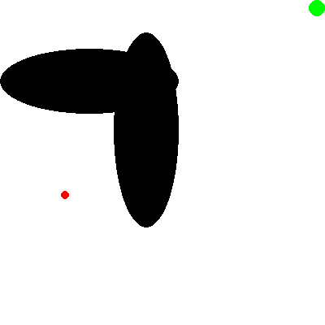
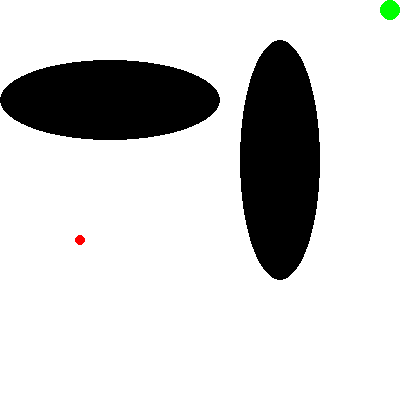
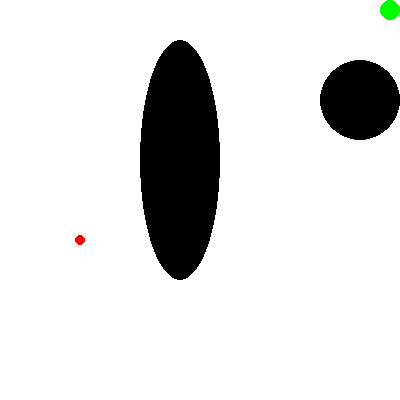
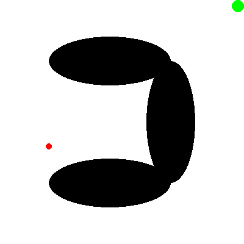
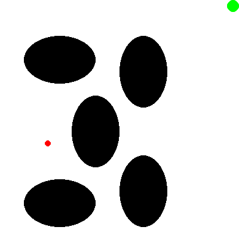

# Puddle World (RL)

Train and evaluate a PPO agent that **generalizes across all 5 Puddle World configurations** using the `gym_puddle` Gymnasium environment.

## Demo

The trained agent successfully navigates all 5 environment configurations:

| Config | Demo                | Reward | Steps |
| ------ | ------------------- | ------ | ----- |
| pw1    |  | -32.00 | 33    |
| pw2    |  | -32.00 | 33    |
| pw3    |  | -24.00 | 25    |
| pw4    |  | -26.00 | 27    |
| pw5    |  | -32.00 | 33    |

## What's in this repo

- `ppo.py`: PPO training + evaluation + interactive "play" mode (renders the learned policy)
- `gym-puddle/`: local Gymnasium environment package (`gym_puddle`) with multiple environment configs
- `ppo_puddleWorld.zip`: saved PPO policy (created by training)
- `vec_normalize.pkl`: saved `VecNormalize` stats (created by training; required for correct eval/render)
- `demos/`: GIF recordings of the trained agent on each configuration
- `record_demos.py`: script to generate demo GIFs

## Environment configs

The agent is trained on all 5 Puddle World configurations in `gym-puddle/gym_puddle/env_configs/`:

- `pw1.json`, `pw2.json`, `pw3.json`, `pw4.json`, `pw5.json`

Each configuration has different puddle placements, requiring the agent to learn generalizable navigation strategies.

## Setup (conda)

```bash
conda create -n puddle-world python=3.10 -y
conda activate puddle-world

# core deps
pip install gymnasium==0.29.1 numpy==1.26.4 pygame==2.5.2 stable-baselines3 matplotlib pillow

# install the local environment package
pip install -e "./gym-puddle"
```

## Training

### Train PPO (multi-config)

```bash
conda activate puddle-world
python ppo.py
```

This produces:

- `ppo_puddleWorld.zip` (trained model)
- `vec_normalize.pkl` (normalization statistics; required for correct evaluation/rendering)

### PPO hyperparameters

The agent uses the following hyperparameters for multi-config generalization:

| Parameter             | Value     | Description                       |
| --------------------- | --------- | --------------------------------- |
| `N_ENVS`            | 20        | Parallel environments             |
| `TOTAL_TIMESTEPS`   | 5,000,000 | Total training steps              |
| `TOTAL_BATCH_SIZE`  | 10,240    | Batch size for updates            |
| `N_STEPS`           | 512       | Steps per env before update       |
| `LEARNING_RATE`     | 3e-4      | Learning rate                     |
| `N_EPOCHS`          | 10        | PPO epochs per update             |
| `BATCH_SIZE`        | 512       | Minibatch size                    |
| `CLIP_RANGE`        | 0.2       | PPO clip range                    |
| `ENT_COEF`          | 0.05      | Entropy coefficient (exploration) |
| `GAMMA`             | 0.99      | Discount factor                   |
| `MAX_EPISODE_STEPS` | 500       | Episode timeout                   |

**Key design choices:**

- **Observation mode**: `"both"` - combines puddle geometry (8 dims) + one-hot config ID (5 dims)
- **Network architecture**: `[512, 256, 128]` for both policy and value networks
- **Goal shaping**: reward shaping based on progress toward goal (coefficient 1.0)
- **VecNormalize**: observation normalization only (no reward normalization)

## Evaluation

### Evaluate on all configs

```bash
python ppo.py --eval --episodes 10
```

### Latest evaluation results

| Config   | Mean Reward | Std    | Steps | Status |
| -------- | ----------- | ------ | ----- | ------ |
| pw1.json | -31.90      | ±1.14 | 33    | PASS   |
| pw2.json | -32.10      | ±0.94 | 33    | PASS   |
| pw3.json | -25.60      | ±1.56 | 27    | PASS   |
| pw4.json | -27.90      | ±1.37 | 29    | PASS   |
| pw5.json | -33.10      | ±1.92 | 34    | PASS   |

**Average reward: -30.12 across all configs (5/5 PASS)**

A reward near -30 indicates efficient paths that largely avoid puddles (environment gives -1 per step outside puddles).

## Play / Render

### Interactive mode

```bash
python ppo.py --play
```

### Render evaluation

```bash
python ppo.py --eval --render --episodes 5
```

### Record demos

```bash
python record_demos.py
```

This generates GIF recordings in the `demos/` directory.

## Notes

- If VS Code shows `Import "gym_puddle" could not be resolved`, select the `puddle-world` interpreter
- The agent learns a generalizable policy by observing puddle geometry, allowing it to navigate unseen puddle configurations
- Higher entropy coefficient (0.05) encourages exploration to find gaps between puddles

## Credits

This project uses the Puddle World Gymnasium environment from:

- https://github.com/EhsanEI/gym-puddle
